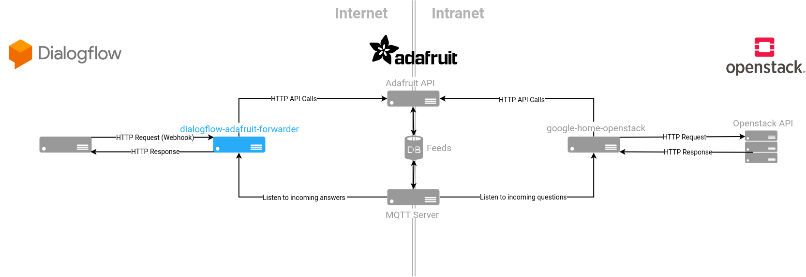

# Dialogflow Adafruit Forwarder

**Application which forwards messages from Dialogflow to Adafruit, so
you do not have to use Google Cloud Functions**

[](https://circleci.com/gh/BRUNNEL6/dialogflow-adafruit-forwarde) [](https://greenkeeper.io/)



## Purpose

`dialogflow-adafruit-forwarder` lets you control your Openstack setup with your Google Home. This application is split into multiple parts; internet-part (this appliaction) and [intranet-part](https://github.com/brunnel6/google-home-openstack).

Thanks to this architecture it is possible to control your Openstack setup, without connecting it to the internet.

The main purpose of this project is to forward the incoming webhook POST-bodies from Dialogflow to Adafruit, listen until an answer gets published by [google-home-openstack](https://github.com/brunnel6/google-home-openstack) and then send a HTTP response back to Dialogflow.

## Getting Started

### From Source

To build it from source, make sure you have NodeJS 9.x.x and Git installed.

```bash

# Clone the repository
git clone https://github.com/brunnel6/dialogflow-adafruit-forwarder.git

# Install the dependencies
npm install
# Build the application
npm run build

# Run the application with your settings
ADAFRUIT_KEY=<KEY> ADAFRUIT_USERNAME=<USERNAME> ADAFRUIT_FEED_ID_IN=<ID> ADAFRUIT_FEED_ID_OUT=<ID> npm start
# curl -X POST http://localhost:3000/ -H 'content-type: application/json' -d '{"query": "123123"}'

```

### Docker

You can use Docker 18.x.x-ce to run the application, without installing NodeJS on your
machine.

```bash

wget https://raw.githubusercontent.com/BRUNNEL6/dialogflow-adafruit-forwarder/master/default.env

# Edit configuration file
vi default.env

docker run \
  --env-file ./default.env \
  -p 3000:3000 \
  -ti brunnel6/dialogflow-adafruit-forwarder:latest

```

### docker-compose (Automatic container updates / SSL)

This `docker-compose` configuration starts [v2tec/watchtower](https://github.com/v2tec/watchtower) in addition to `dialogflow-adafruit-forwarder`. Watchtower watches over the docker image and updates it, if a new docker image version is public.

```bash

wget https://raw.githubusercontent.com/BRUNNEL6/dialogflow-adafruit-forwarder/master/default.env
wget https://raw.githubusercontent.com/BRUNNEL6/dialogflow-adafruit-forwarder/master/docker-compose.yml
# Edit configuration file
vi default.env
mv default.env cred.env

# Start applications
docker-compose up

```

Move your SSL certifiaces into the certs folder of this repository. The cert / key must have the same name as the defined VIRTUAL_HOST environment variable (in the `cred.env` file)

```bash

mkdir certs
mv /path/to/mydomain.com.cert certs/
mv /path/to/mydomain.com.key certs/

```

## Environment variables

The environment variables

| Variable Name        | Description                                                                | Type    | Example                                      | Default | Required |
|:---------------------|:---------------------------------------------------------------------------|:--------|:---------------------------------------------|:--------|:---------|
| ADAFRUIT_KEY         | The API Key of Adafruit                                                    | string  | `ADAFRUIT_KEY="<SECRET>"`                    | -       | true     |
| ADAFRUIT_USERNAME    | If should only simulate this app (not actually alter anything permanently) | string  | `ADAFRUIT_USERNAME="<USERNAME>"`             | -       | true     |
| ADAFRUIT_FEED_ID_IN  | The Adafruit Feed which this application listens to                        | string  | `ADAFRUIT_FEED_ID_IN="google-openstack-out"` | -       | true     |
| ADAFRUIT_FEED_ID_OUT | The Adafruit Feed which this application sends messages to                 | string  | `ADAFRUIT_FEED_ID_OUT="google-openstack-in"` | -       | true     |
| NO_EMOJI             | Do not print any emojis                                                    | boolean | `NO_EMOJI=true`                              | false   | false    |
| LOG_LEVEL            | The level of the log (error, warn, info, debug, silly)                     | string  | `LOG_LEVEL=silly`                            | info    | false    |
| PORT                 | The port of the webserver                                                  | number  | `PORT=3000`                                  | 3000    | false    |
| VIRTUAL_HOST         | Only if running with `docker-compose`.                                     | string  | `VIRTUAL_HOST=mydomain.com`                     | -       | false    |

## Related

- [google-home-openstack](https://github.com/BRUNNEL6/google-home-openstack): Application which creates Openstack Virtual Machines when command Google Home to..

## People

- [Livio Brunner](https://github.com/BrunnerLivio) - Author
- [Eric Keller](https://github.com/erickellerek1) - Idea
